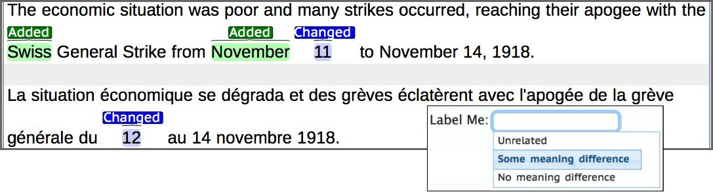

# REFreSD

This repository contains the **R**ationalized **E**nglish-**Fre**nch **S**emantic **D**ivergences (REFreSD) dataset, that consists of 1,039 English-French sentence-pairs annotated with sentence-level divergence judgments and token-level rationales. 

    
<p align="center">
    
</p>

## Raw dataset

The non-tokenized version of the dataset along with sentence level judgments can be found under ```REFreSD_sentence_labels```. 
The ```REFreSD_rationales``` file is augmented with annotation rationales. Note that the latter is tokenized so that each 
rationalized tag is assigned to a token.  

## Pre-processed version of the dataset 

We releaze the tokenized version of our data formatted so that they can be directly processed
by a transformer-based model as implemented on top of the [HuggingFace](https://github.com/huggingface/transformers)
library. The pre-processed version can be found under ```REFreSD_for_huggingface```.

## Sentence-tags notation

The whole dataset can be found under the ````REFreSD_for_huggingface/test.tsv```` file. The first tab denotes the gold standard
labels for the sentence-level task (as aggregated using majority vote). Label 0 corresponds to equivalents,
while label 1 corresponds to divergent instances. Within this directory we also include separately two subversions of the dataset:
the ```some_meaning_difference.tsv``` and the ```unrelated.tsv``` in which we only include divergences from one class (denoted by the
name of each tsv file).  

## Token-tags notation

Each sentence-pair is followed by token level tags corresponding to [0,1,2,3]. 0 denotes that this
token has not been highlighted by any of the annotators, 1,2,3 denote that the token has been highlighted by
1,2 and 3 annotators, respectively. 

## Contact

If you use any contents of this repository, please cite us. For any questions, write to ebriakou@cs.umd.edu.

```
@inproceedings{briakou2020emnlp,
    title = {Detecting fine-grained cross-lingual semantic divergences without supervision by learning to rank},
    author = {Eleftheria Briakou and Marine Carpuat},
    booktitle = {EMNLP},
    address = {},
    month = {},
    url = {},
    year = {2020}
}
```
